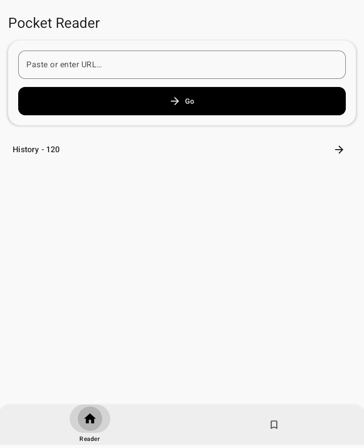
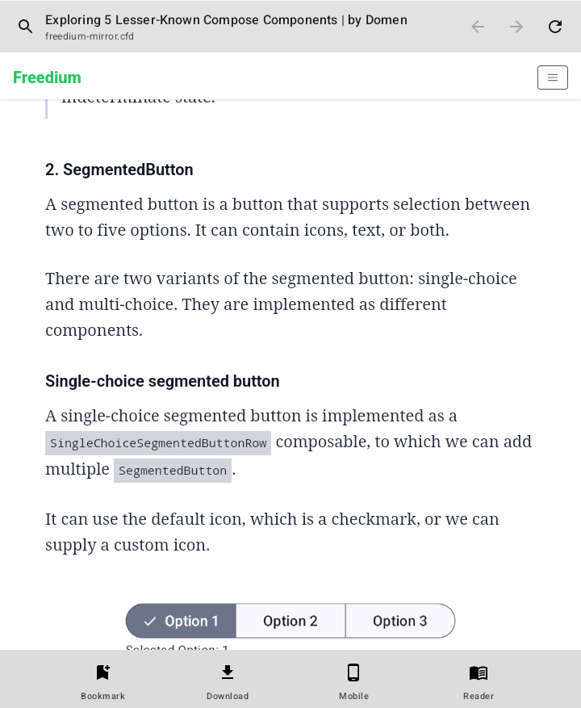
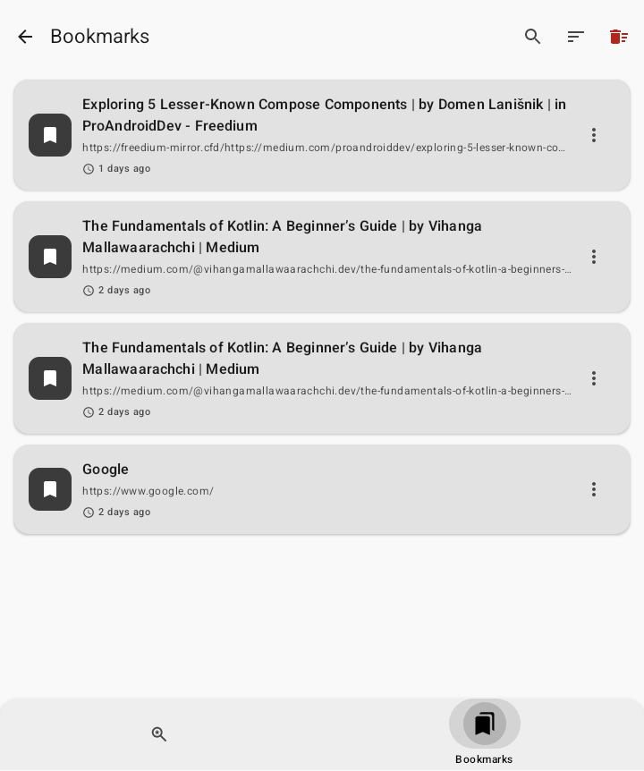
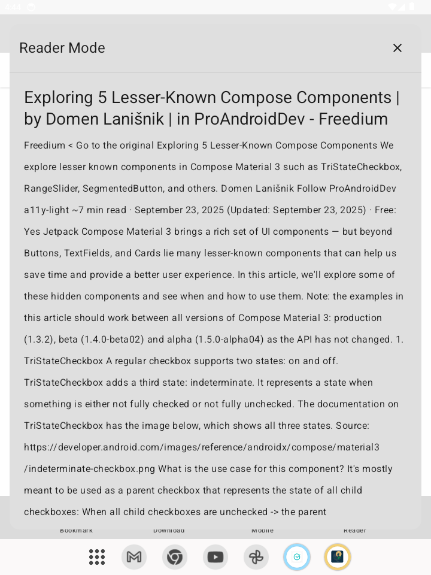

## Pocket Reader

Read and save web pages with history, bookmarks, desktop mode, and reader mode.

---

### Overview

Pocket Reader is an Android app built with **Kotlin** and **Jetpack Compose** that lets you:

- Open links from any app into a clean in‑app **WebView**
- Save pages to **history** and **bookmarks**
- Switch between **mobile** and **desktop** view
- Enable **reader mode** for long articles
- Open shared links directly from other apps

---

### Features

- **Smart WebView**
  - Mobile / Desktop view toggle
  - Reader mode to extract article text
  - Ad host blocking for a cleaner page

- **History & Bookmarks**
  - Automatic history with duplicate protection
  - One‑tap bookmarking from WebView
  - Bookmark list with search and sorting

- **Share Integration**
  - Open shared links directly into Pocket Reader
  - Medium links can be opened via Freedium for paywall‑free reading

- **UI & UX**
  - Jetpack Compose + Material 3
  - Dark mode & reader‑friendly dialogs
  - Debounced buttons (no accidental multi‑clicks)

---

### Screenshots

> Update the image paths once you add screenshots under `assets/`.

| Home | WebView (Mobile)|
|------|------------------|-------------------|
|  |  |

| Bookmarks                 | Reader Mode                |
|---------------------------|----------------------------|
|  |  |

---

### Tech Stack

- **Language:** Kotlin  
- **UI:** Jetpack Compose, Material 3  
- **Architecture:** Layered structure (`data` / `domain` / `ui`)  
- **State Management:** `StateFlow` + UI state data classes  
- **DI:** Hilt  
- **Persistence:** Room  
- **Networking / Parsing:** Jsoup (for page metadata)  
- **Image Loading:** Coil (for bookmark previews)  

---

### Project Structure

```text
app/
  src/main/java/com/sujith/pocket/
    data/          # Room DAOs, entities, repositories
    domain/        # DTOs, repository interfaces
    ui/
      components/  # Reusable composables (buttons, top bar, loading)
      navigation/  # NavHost and routes
      screens/
        home/
        webview/
        bookmarks/
    utils/         # Constants, UrlHelper, extensions
```

---

### Installation

1. Clone this repo  
   ```bash
   git clone https://github.com/sujith014/pocket.git
   cd pocket
   ```
2. Open the project in **Android Studio** (Giraffe or newer)  
3. Let Gradle sync  
4. Run on a device or emulator (Android 8.0+ recommended)  

Optionally later:

- Build a release APK and upload it under **Releases** on GitHub  
- Users can then download and install the APK directly on their devices

---

### Usage

- Open the app, paste or type a URL, then tap **Go**
- Share a link from any browser or app → select **Pocket Reader** to open it in the WebView
- Use the bottom bar in WebView to:
  - Bookmark the current page
  - Download as PDF or image
  - Toggle between **Mobile** and **Desktop** view
  - Enter **Reader** mode

---

